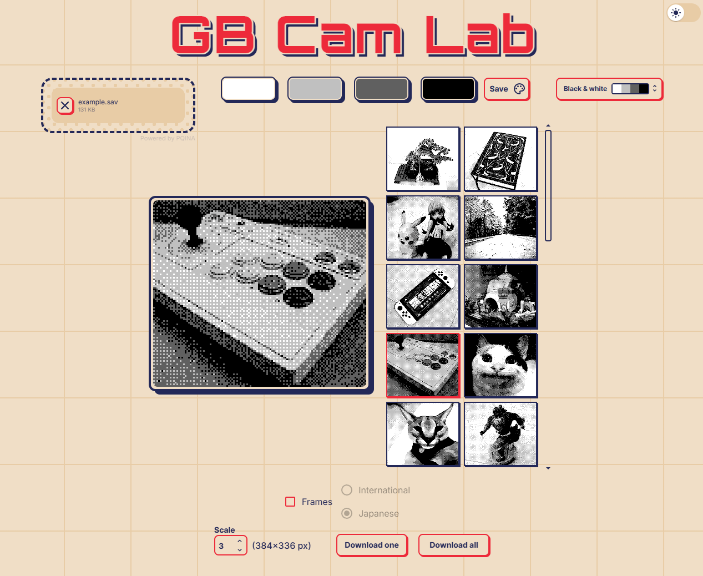

# GB Cam Lab

The tool: [GB Cam Lab](https://gbcamlab.vercel.app/)

A simple tool for exporting and editing photos from Gameboy Camera save files.

If you like GB Cam Lab and want to support my work, consider [Buying me a coffee ☕](https://ko-fi.com/romanobaraz)

## Features

-   **Photo Extraction**  
    Upload a GameBoy Camera save file and extract photos directly from it.

-   **Recoloring**  
    Recolor your extracted photos using custom palettes created directly within the tool.

-   **Palette Presets**  
    Save your user-created palettes as presets for quick and easy reuse.

-   **Image Scaling**  
    Scale your extracted photos to different sizes while maintaining their pixel-perfect quality.

-   **Photo Frames**  
    Toggle on/off GameBoy Camera photo frames. Choose between international and Japanese frames.

## License

This project is licensed under the MIT License - see the [LICENSE](./LICENSE) file for details.
